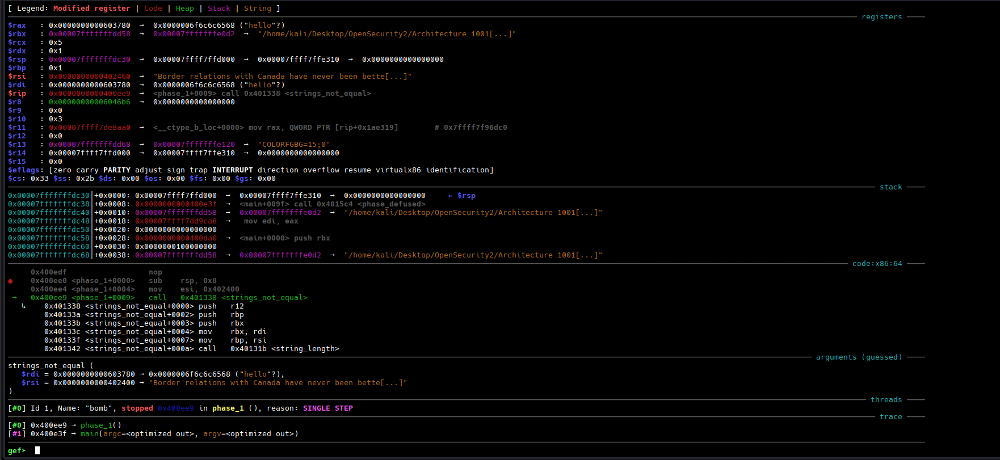

## Input Logic (main)

Below is basically the pseudo logic code of giving the input in the bomb lab phase 1.

```c
if (command-line-argument > 2) {
    printf("usage : ..... %s", argv[0]);   // ❌ too many args
}
else if (command-line-argument == 2) {
    printf("error couldnt open %s", argv[0], argv[1]); // ❌ bad file open
}
else if (command-line-argument == 1) {
    // ✅ valid case: take input from standard input
    input = readline();
}
```

✔ Only when `argc == 1` (`./bomb`) does the bomb take user input.  
❌ `argc == 2` tries to open a file and fails.  
❌ `argc > 2` gives a usage error.

#### INPUT PASSING

1. Program waits for user input (via `readline()`).    
2. Input string is passed as the **argument to phase_1**.
3. Phase 1 compares the input with a **hidden reference string** in memory.

## Phase 1 Disassembly

```gdb
0x0000000000400ee0 <+0>:     sub    rsp,0x8
0x0000000000400ee4 <+4>:     mov    esi,0x402400
0x0000000000400ee9 <+9>:     call   0x401338 <strings_not_equal>
0x0000000000400eee <+14>:    test   eax,eax
0x0000000000400ef0 <+16>:    je     0x400ef7 <phase_1+23>
0x0000000000400ef2 <+18>:    call   0x40143a <explode_bomb>
0x0000000000400ef7 <+23>:    add    rsp,0x8
0x0000000000400efb <+27>:    ret
```


I passed **"hello"** as the input string first. You can clearly see from the below registers info that the first **argument1** = **rdi** (user Input String) and **argument2** = **rsi** (Original String)

- `rdi` -> **user input string**
- `esi = 0x402400` → address of **reference string** 
- **Reference String** -> **Border relations with Canada have never been better.** Its better to examine the **rsi** register using `x/s $rsi` in gdb.




Honestly, speaking you can just pass the correct string and defuse phase 1 flag , but I recommend to give the wrong string and check how the code logic works to rectify how your input string is wrong. 

## strings_not_equal Disassembly

```gdb
   0x0000000000401338 <+0>:     push   r12
   0x000000000040133a <+2>:     push   rbp
   0x000000000040133b <+3>:     push   rbx
   0x000000000040133c <+4>:     mov    rbx,rdi
   0x000000000040133f <+7>:     mov    rbp,rsi
   0x0000000000401342 <+10>:    call   0x40131b <string_length>
   0x0000000000401347 <+15>:    mov    r12d,eax
   0x000000000040134a <+18>:    mov    rdi,rbp
   0x000000000040134d <+21>:    call   0x40131b <string_length>
   0x0000000000401352 <+26>:    mov    edx,0x1
   0x0000000000401357 <+31>:    cmp    r12d,eax
   0x000000000040135a <+34>:    jne    0x40139b <strings_not_equal+99>
   0x000000000040135c <+36>:    movzx  eax,BYTE PTR [rbx]
   0x000000000040135f <+39>:    test   al,al
   0x0000000000401361 <+41>:    je     0x401388 <strings_not_equal+80>
   0x0000000000401363 <+43>:    cmp    al,BYTE PTR [rbp+0x0]
   0x0000000000401366 <+46>:    je     0x401372 <strings_not_equal+58>
   0x0000000000401368 <+48>:    jmp    0x40138f <strings_not_equal+87>
   0x000000000040136a <+50>:    cmp    al,BYTE PTR [rbp+0x0]
   0x000000000040136d <+53>:    nop    DWORD PTR [rax]
   0x0000000000401370 <+56>:    jne    0x401396 <strings_not_equal+94>
   0x0000000000401372 <+58>:    add    rbx,0x1
   0x0000000000401376 <+62>:    add    rbp,0x1
   0x000000000040137a <+66>:    movzx  eax,BYTE PTR [rbx]
   0x000000000040137d <+69>:    test   al,al
   0x000000000040137f <+71>:    jne    0x40136a <strings_not_equal+50>
   0x0000000000401381 <+73>:    mov    edx,0x0
   0x0000000000401386 <+78>:    jmp    0x40139b <strings_not_equal+99>
   0x0000000000401388 <+80>:    mov    edx,0x0
   0x000000000040138d <+85>:    jmp    0x40139b <strings_not_equal+99>
   0x000000000040138f <+87>:    mov    edx,0x1
   0x0000000000401394 <+92>:    jmp    0x40139b <strings_not_equal+99>
   0x0000000000401396 <+94>:    mov    edx,0x1
   0x000000000040139b <+99>:    mov    eax,edx
   0x000000000040139d <+101>:   pop    rbx
   0x000000000040139e <+102>:   pop    rbp
   0x000000000040139f <+103>:   pop    r12
   0x00000000004013a1 <+105>:   ret
```


## strings_length Disassembly

```gdb
   0x000000000040131b <+0>:     cmp    BYTE PTR [rdi],0x0
   0x000000000040131e <+3>:     je     0x401332 <string_length+23>
   0x0000000000401320 <+5>:     mov    rdx,rdi
   0x0000000000401323 <+8>:     add    rdx,0x1
   0x0000000000401327 <+12>:    mov    eax,edx
   0x0000000000401329 <+14>:    sub    eax,edi
   0x000000000040132b <+16>:    cmp    BYTE PTR [rdx],0x0
   0x000000000040132e <+19>:    jne    0x401323 <string_length+8>
   0x0000000000401330 <+21>:    repz ret
   0x0000000000401332 <+23>:    mov    eax,0x0
   0x0000000000401337 <+28>:    ret
```


## strings_not_equal LOGIC

- Anyway, after you enter your string the program will call the **strings_not_equal()** label and pass the **rdi**, **rsi** (**args1**, **args2**)
- From there, **strings_length()** label is there which would calculate the length of your user input string and match with the reference string. 
- If the length of the string is not equal then it returns 1 and the string comparison checking fails and the **bomb explodes**.
- If the length of the string matches then it compares each byte of the user input string and byte of the reference string in their hexadecimal format. 
- If the checking fails, then return 1 and **bomb explodes** else return 0 **bomb defused** and **phase1 passed**.