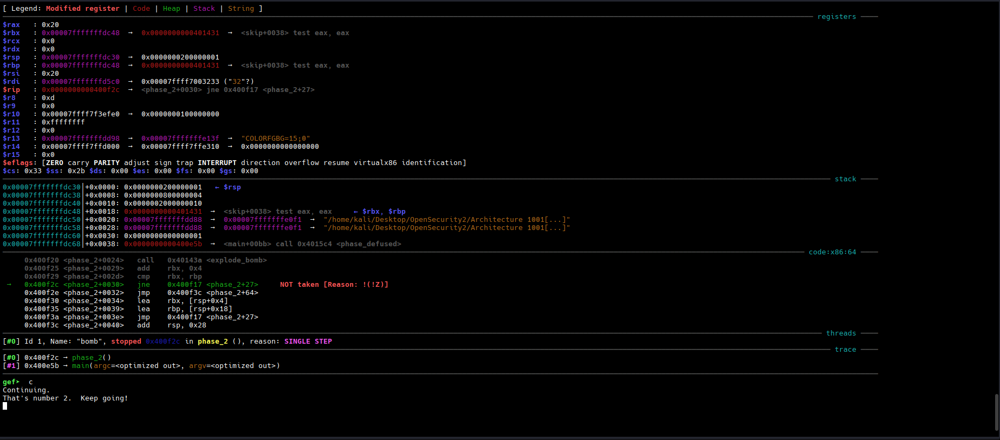

- For getting into phase 2 you need to complete the phase 1 first. 
- After completing phase 1 you will get a string which would defuse the bomb and lead to phase 2
- Its better to store the phase pass phrases into a text file and running it instead of manually giving the passing phrase every time.

## phase_2 disassembly

```gdb
   0x0000000000400efc <+0>:     push   rbp
   0x0000000000400efd <+1>:     push   rbx
   0x0000000000400efe <+2>:     sub    rsp,0x28
   0x0000000000400f02 <+6>:     mov    rsi,rsp
   0x0000000000400f05 <+9>:     call   0x40145c <read_six_numbers>
   0x0000000000400f0a <+14>:    cmp    DWORD PTR [rsp],0x1
   0x0000000000400f0e <+18>:    je     0x400f30 <phase_2+52>
   0x0000000000400f10 <+20>:    call   0x40143a <explode_bomb>
   0x0000000000400f15 <+25>:    jmp    0x400f30 <phase_2+52>
   0x0000000000400f17 <+27>:    mov    eax,DWORD PTR [rbx-0x4]
   0x0000000000400f1a <+30>:    add    eax,eax
   0x0000000000400f1c <+32>:    cmp    DWORD PTR [rbx],eax
   0x0000000000400f1e <+34>:    je     0x400f25 <phase_2+41>
   0x0000000000400f20 <+36>:    call   0x40143a <explode_bomb>
   0x0000000000400f25 <+41>:    add    rbx,0x4
   0x0000000000400f29 <+45>:    cmp    rbx,rbp
   0x0000000000400f2c <+48>:    jne    0x400f17 <phase_2+27>
   0x0000000000400f2e <+50>:    jmp    0x400f3c <phase_2+64>
   0x0000000000400f30 <+52>:    lea    rbx,[rsp+0x4]
   0x0000000000400f35 <+57>:    lea    rbp,[rsp+0x18]
   0x0000000000400f3a <+62>:    jmp    0x400f17 <phase_2+27>
   0x0000000000400f3c <+64>:    add    rsp,0x28
   0x0000000000400f40 <+68>:    pop    rbx
   0x0000000000400f41 <+69>:    pop    rbp
   0x0000000000400f42 <+70>:    ret
```

Analyzing the disassembly of the **phase_2** disassembly you will find that it compares the value of `DWORD PTR [rsp]` with `0x1`. Also there is another label name **read_six_numbers**. This tells us that the first number we pass should be 1 so that the comparison works out.


## read_six_numbers disassembly

```gdb
   0x000000000040145c <+0>:     sub    rsp,0x18
   0x0000000000401460 <+4>:     mov    rdx,rsi
   0x0000000000401463 <+7>:     lea    rcx,[rsi+0x4]
   0x0000000000401467 <+11>:    lea    rax,[rsi+0x14]
   0x000000000040146b <+15>:    mov    QWORD PTR [rsp+0x8],rax
   0x0000000000401470 <+20>:    lea    rax,[rsi+0x10]
   0x0000000000401474 <+24>:    mov    QWORD PTR [rsp],rax
   0x0000000000401478 <+28>:    lea    r9,[rsi+0xc]
   0x000000000040147c <+32>:    lea    r8,[rsi+0x8]
   0x0000000000401480 <+36>:    mov    esi,0x4025c3
   0x0000000000401485 <+41>:    mov    eax,0x0
   0x000000000040148a <+46>:    call   0x400bf0 <__isoc99_sscanf@plt>
   0x000000000040148f <+51>:    cmp    eax,0x5
   0x0000000000401492 <+54>:    jg     0x401499 <read_six_numbers+61>
   0x0000000000401494 <+56>:    call   0x40143a <explode_bomb>
   0x0000000000401499 <+61>:    add    rsp,0x18
   0x000000000040149d <+65>:    ret
```

There is a checking if **eax** is greater than **0x5** or not. If it is false then the bomb explodes. We have to pass 6 integers to bypass this.


Now coming back to the **phase_2** disassembly there is a certain looping between instructions `0x0000000000400f17 <+27>:    mov    eax,DWORD PTR [rbx-0x4]` to ` 0x0000000000400f2c <+48>:    jne    0x400f17 <phase_2+27>`. Basically it compares the values between `eax` and `DWORD PTR [rbx]`. If they are unequal then bomb explodes else it continues to execute the below instructions but there is a catch! 

Look at the comparison between `rbx` and `rbp`. If they are not equal the program will again jump at **<phase_2+27>** line. If we somehow make the values of the **rbx** and **rbp** equal we will be able to solve this phase. To do that we need the right number sequence and the number of digits passed needs to be 6. After failing numerous number of times, and also with a bit of help I was able to understand the order sequence of the numbers. Since we already know the first number is **1** , the next 5 numbers are basically **num1, num1x2, num2x2, num3x2 ... num5x2**


