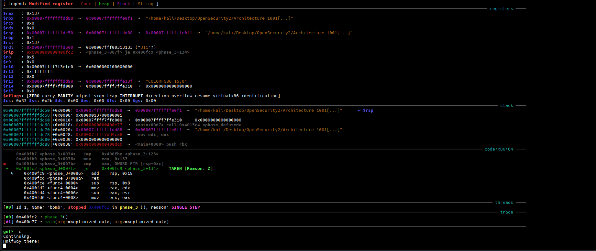

- For getting into phase 3 you need to complete phase 2 first.
- To enter phase 3 give the passing phrase for phase 1 and phase 2.
- Its better to store the passing phrases for each level into a single file and run it instead of manually typing in each time.


## phase_3 disassembly

```gdb
   0x0000000000400f43 <+0>:     sub    rsp,0x18
   0x0000000000400f47 <+4>:     lea    rcx,[rsp+0xc]
   0x0000000000400f4c <+9>:     lea    rdx,[rsp+0x8]
   0x0000000000400f51 <+14>:    mov    esi,0x4025cf
   0x0000000000400f56 <+19>:    mov    eax,0x0
   0x0000000000400f5b <+24>:    call   0x400bf0 <__isoc99_sscanf@plt>
   0x0000000000400f60 <+29>:    cmp    eax,0x1
   0x0000000000400f63 <+32>:    jg     0x400f6a <phase_3+39>
   0x0000000000400f65 <+34>:    call   0x40143a <explode_bomb>
   0x0000000000400f6a <+39>:    cmp    DWORD PTR [rsp+0x8],0x7
   0x0000000000400f6f <+44>:    ja     0x400fad <phase_3+106>
   0x0000000000400f71 <+46>:    mov    eax,DWORD PTR [rsp+0x8]
   0x0000000000400f75 <+50>:    jmp    QWORD PTR [rax*8+0x402470]
   0x0000000000400f7c <+57>:    mov    eax,0xcf
   0x0000000000400f81 <+62>:    jmp    0x400fbe <phase_3+123>
   0x0000000000400f83 <+64>:    mov    eax,0x2c3
   0x0000000000400f88 <+69>:    jmp    0x400fbe <phase_3+123>
   0x0000000000400f8a <+71>:    mov    eax,0x100
   0x0000000000400f8f <+76>:    jmp    0x400fbe <phase_3+123>
   0x0000000000400f91 <+78>:    mov    eax,0x185
   0x0000000000400f96 <+83>:    jmp    0x400fbe <phase_3+123>
   0x0000000000400f98 <+85>:    mov    eax,0xce
   0x0000000000400f9d <+90>:    jmp    0x400fbe <phase_3+123>
   0x0000000000400f9f <+92>:    mov    eax,0x2aa
   0x0000000000400fa4 <+97>:    jmp    0x400fbe <phase_3+123>
   0x0000000000400fa6 <+99>:    mov    eax,0x147
   0x0000000000400fab <+104>:   jmp    0x400fbe <phase_3+123>
   0x0000000000400fad <+106>:   call   0x40143a <explode_bomb>
   0x0000000000400fb2 <+111>:   mov    eax,0x0
   0x0000000000400fb7 <+116>:   jmp    0x400fbe <phase_3+123>
   0x0000000000400fb9 <+118>:   mov    eax,0x137
   0x0000000000400fbe <+123>:   cmp    eax,DWORD PTR [rsp+0xc]
   0x0000000000400fc2 <+127>:   je     0x400fc9 <phase_3+134>
   0x0000000000400fc4 <+129>:   call   0x40143a <explode_bomb>
   0x0000000000400fc9 <+134>:   add    rsp,0x18
   0x0000000000400fcd <+138>:   ret
```

Analyze the disassembly carefully.

When the `mov esi, 0x4025cf` instruction gets executed, if you examine the **esi** register in string format using `x/s $esi` we get this -> **%d %d**. This means the **__isoc99_sscanf@plt** label is taking two numbers as parameters. When the code execution returns from the label we have `cmp eax, 0x1`. We have to pass two numbers to make the count of **eax** greater than 1 otherwise the bomb explodes.

At ` 0x0000000000400f6a <+39>:    cmp    DWORD PTR [rsp+0x8],0x7` this line compares `0x7` with the first number we pass. You can verify this examining the stack. If the first number we pass is greater than `0x7` , code jumps at `0x0000000000400fad <+106>:   call   0x40143a <explode_bomb>` and as usual the bomb explodes. Now its clear that we need to pass 2 numbers and also the first number has to be less than `0x7`. 


## Something interesting....

```gdb
   0x0000000000400fb9 <+118>:   mov    eax,0x137
   0x0000000000400fbe <+123>:   cmp    eax,DWORD PTR [rsp+0xc]
   0x0000000000400fc2 <+127>:   je     0x400fc9 <phase_3+134>
   0x0000000000400fc4 <+129>:   call   0x40143a <explode_bomb>
   0x0000000000400fc9 <+134>:   add    rsp,0x18
   0x0000000000400fcd <+138>:   ret
```

Notice something interesting here, **eax** was previously as a counter to store number of digits we pass. Now `0x137` is moved to the **eax** register. `DWORD PTR [rsp+0xc]` is basically the second number we pass during the input. If **eax** i.e `0x137` is equal to **second number** then we pass the phase_3!!!. To reach this area you must maintain the above conditions mentioned in the **phase_3 disassembly** section, otherwise the bomb will explode!!!. 

I noticed the value of **eax** is made `0x137` when at `0x0000000000400f75 <+50>:    jmp    QWORD PTR [rax*8+0x402470]` the jump address is calculated and we jump to the above code section. So beware of the first number you pass because based upon that later you will jump to the necessary code section and change your **eax** value accordingly. The value I gave led me to the above code section.


