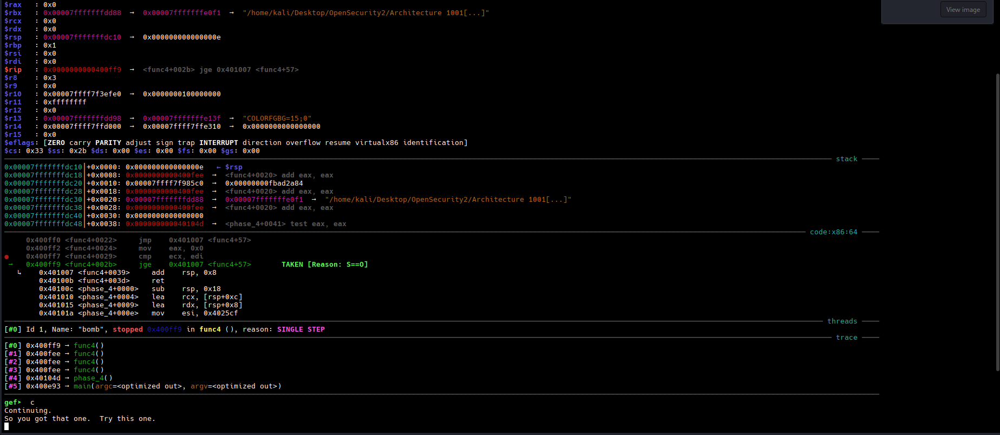

- For getting into phase 4 you need to pass phase 3 first.
- To enter phase 4, you need phase 1, 2, 3 passing phrases.
- Its better to store passing phrases for each level into a single file and run it instead of manually typing it each time.


## phase_4 disassembly

```gdb
   0x000000000040100c <+0>:     sub    rsp,0x18
   0x0000000000401010 <+4>:     lea    rcx,[rsp+0xc]
   0x0000000000401015 <+9>:     lea    rdx,[rsp+0x8]
   0x000000000040101a <+14>:    mov    esi,0x4025cf
   0x000000000040101f <+19>:    mov    eax,0x0
   0x0000000000401024 <+24>:    call   0x400bf0 <__isoc99_sscanf@plt>
   0x0000000000401029 <+29>:    cmp    eax,0x2
   0x000000000040102c <+32>:    jne    0x401035 <phase_4+41>
   0x000000000040102e <+34>:    cmp    DWORD PTR [rsp+0x8],0xe
   0x0000000000401033 <+39>:    jbe    0x40103a <phase_4+46>
   0x0000000000401035 <+41>:    call   0x40143a <explode_bomb>
   0x000000000040103a <+46>:    mov    edx,0xe
   0x000000000040103f <+51>:    mov    esi,0x0
   0x0000000000401044 <+56>:    mov    edi,DWORD PTR [rsp+0x8]
   0x0000000000401048 <+60>:    call   0x400fce <func4>
   0x000000000040104d <+65>:    test   eax,eax
   0x000000000040104f <+67>:    jne    0x401058 <phase_4+76>
   0x0000000000401051 <+69>:    cmp    DWORD PTR [rsp+0xc],0x0
   0x0000000000401056 <+74>:    je     0x40105d <phase_4+81>
   0x0000000000401058 <+76>:    call   0x40143a <explode_bomb>
   0x000000000040105d <+81>:    add    rsp,0x18
   0x0000000000401061 <+85>:    ret
```

Analyze the phase 4 carefully.

If you have solved the previous levels you will probably be able to understand that at `0x0000000000401024 <+24>:    call   0x400bf0 <__isoc99_sscanf@plt>` and `0x0000000000401029 <+29>:    cmp    eax,0x2` asks the user to input 2 integers. You can verify this by examining the memory address when the **instruction pointer** reaches at `cmp eax, 0x2` line. Examine the address in string format using `x/s $rsi`.


At `0x000000000040102e <+34>:    cmp    DWORD PTR [rsp+0x8],0xe` we compare the first number with `0xe`. You can check the stack to verify if the number you are comparing is the first number or not. If our number is greater than `0xe` then the bomb explodes!!!. Our number therefore has to be less than `0xe`. After that a couple of assembly instructions gets executed and **func4** label is called.


## func4 disassembly

```gdb
   0x0000000000400fce <+0>:     sub    rsp,0x8
   0x0000000000400fd2 <+4>:     mov    eax,edx
   0x0000000000400fd4 <+6>:     sub    eax,esi
   0x0000000000400fd6 <+8>:     mov    ecx,eax
   0x0000000000400fd8 <+10>:    shr    ecx,0x1f
   0x0000000000400fdb <+13>:    add    eax,ecx
   0x0000000000400fdd <+15>:    sar    eax,1
   0x0000000000400fdf <+17>:    lea    ecx,[rax+rsi*1]
   0x0000000000400fe2 <+20>:    cmp    ecx,edi
   0x0000000000400fe4 <+22>:    jle    0x400ff2 <func4+36>
   0x0000000000400fe6 <+24>:    lea    edx,[rcx-0x1]
   0x0000000000400fe9 <+27>:    call   0x400fce <func4>
   0x0000000000400fee <+32>:    add    eax,eax
   0x0000000000400ff0 <+34>:    jmp    0x401007 <func4+57>
   0x0000000000400ff2 <+36>:    mov    eax,0x0
   0x0000000000400ff7 <+41>:    cmp    ecx,edi
   0x0000000000400ff9 <+43>:    jge    0x401007 <func4+57>
   0x0000000000400ffb <+45>:    lea    esi,[rcx+0x1]
   0x0000000000400ffe <+48>:    call   0x400fce <func4>
   0x0000000000401003 <+53>:    lea    eax,[rax+rax*1+0x1]
   0x0000000000401007 <+57>:    add    rsp,0x8
   0x000000000040100b <+61>:    ret
```


A hell lot of mathematical operations like bitwise right shifting logical and arithmetical operations get performed here. The **ecx** and **edi** register values get interchanged with other stuff numerous number of times so its hard to keep track.According to the below instructions at `0x0000000000400fe2 <+20>:    cmp    ecx,edi` if **eci** greater than **edi** then the label **func4** is called again. If **ecx** is less than **edi** then again its compared where to check if **ecx** is greater than **edi** but a comparison can have only one result .... a number cannot be greater and smaller to the same number comparison. But since `e` is mentioned with the condition means **both ecx and edi** can be **0**. This avoids unnecessary calculations since **0** is a constant and easily maintains its quantity value.

```gdb
   0x0000000000400fe2 <+20>:    cmp    ecx,edi
   0x0000000000400fe4 <+22>:    jle    0x400ff2 <func4+36>
```


At `0x0000000000401051 <+69>:    cmp    DWORD PTR [rsp+0xc],0x0` tells us that the second number also has to be **0** otherwise the bomb explodes





